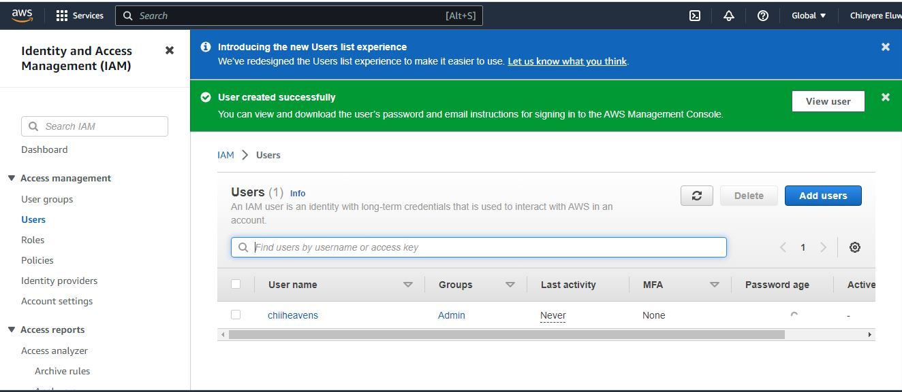
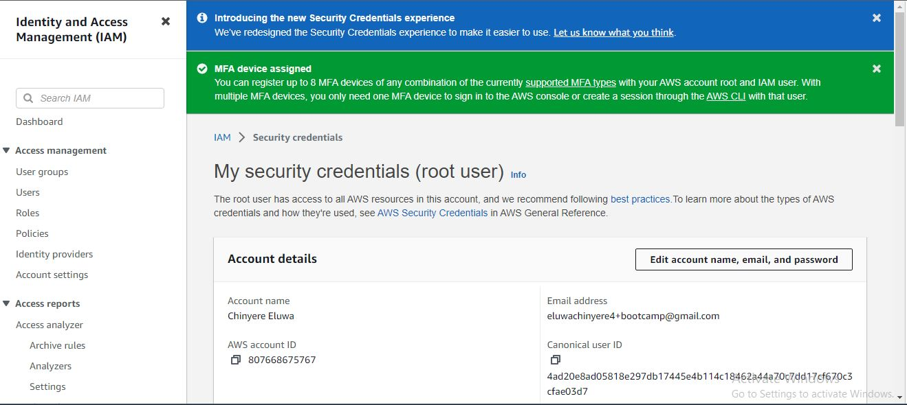
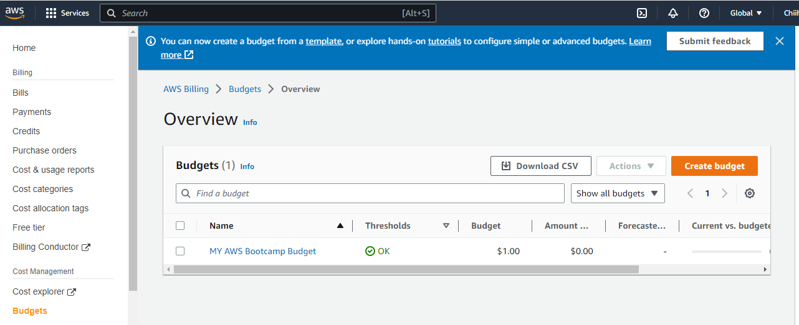
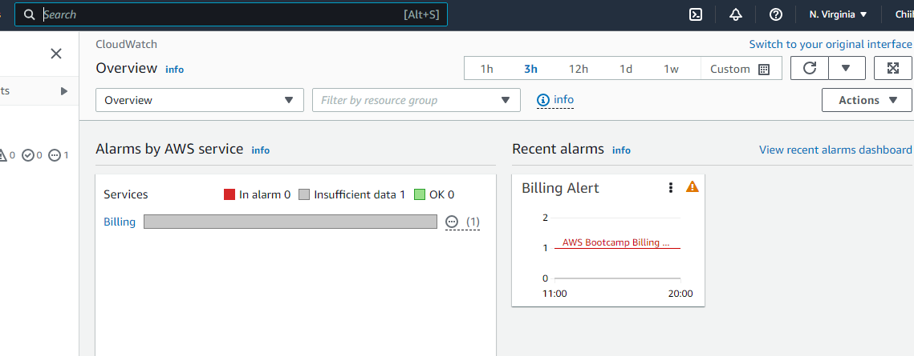
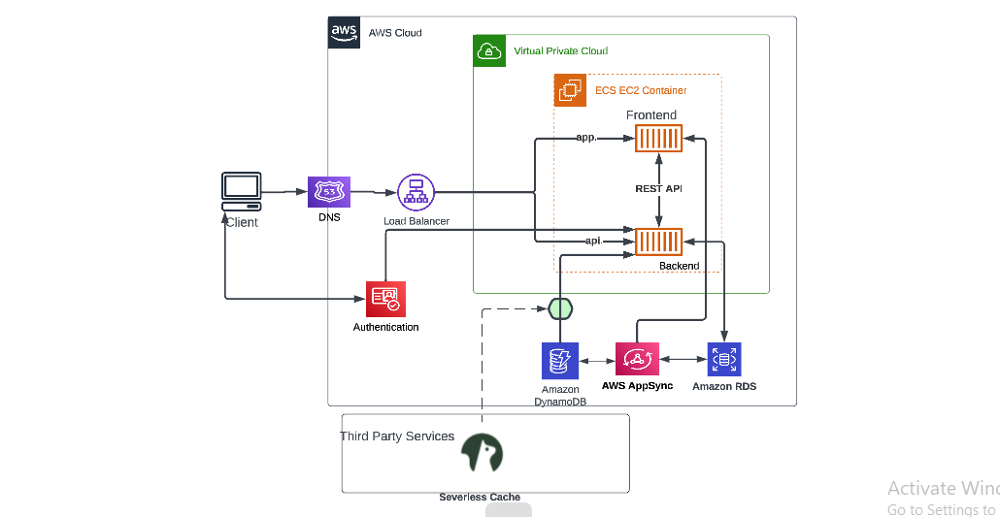
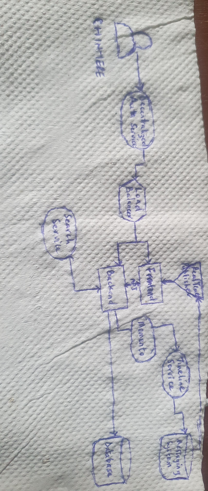

# Week 0 — Billing and Architecture

## Required Tasks

### Install AWS CLI

I was not able to use Github to install AWS CLI 
I started with it but along the line, I got stuck and couldn't figure out where the mistake was coming from.
So I decided to use a local environment to install AWS CLI.

I installed the AWS CLI through the **Command prompt**
```
msiexec.exe /i https://awscli.amazonaws.com/AWSCLIV2.msi

```
I confirmed the installation using the command prompt by typing cmd in the Start menu and typed 
```
aws --version
```

### Created an Admin User

I created an Admin User



### Generate AWS Credemtials

I generated AWS Credentials for my root account



### Create a Budget

I created a budget for $1 because i don't have suficient to spend
I didn't create a second budget because I was being careful not to spend over the two budget free limit



### Create a Billing Alarm

I created a Billing Alarm



### Recreate Logical Architectural Design



[Lucid Chart Shared Link](https://lucid.app/lucidchart/ba316896-b76f-4c55-8286-cc4ebb656e8a/edit?viewport_loc=-83%2C-2%2C1874%2C876%2C0_0&invitationId=inv_4598a208-bd60-490b-ba3f-5e5f318b1ec2)

### Recreate Conceptual Diagram on a Napkin

I recreated a Conceptual diagram on a Napkin



### Homework Challenges

I had several homework challenges. One of which was my inability to install CLI on Github.

I started installing it but got stuck along the line and couldn't figure out my mistake or go back to start afresh.

Another challenge I had was my inability to use Cloudshell in my management console for the IAM user, the error message I get is: unable to start the environment. To retry, refresh the browser, or restart by selecting Actions, Restart AWS Cloudshell. 


